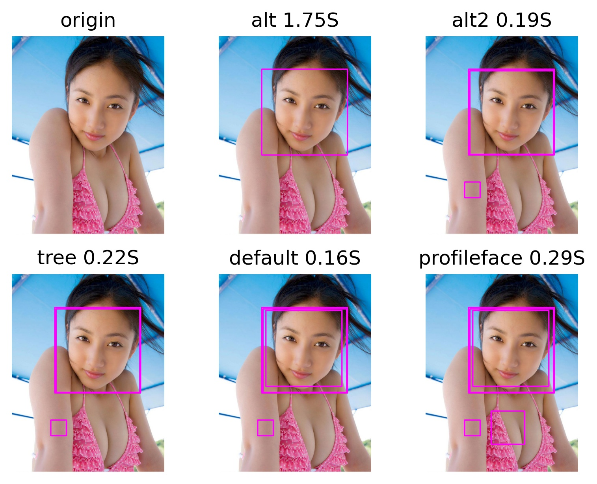
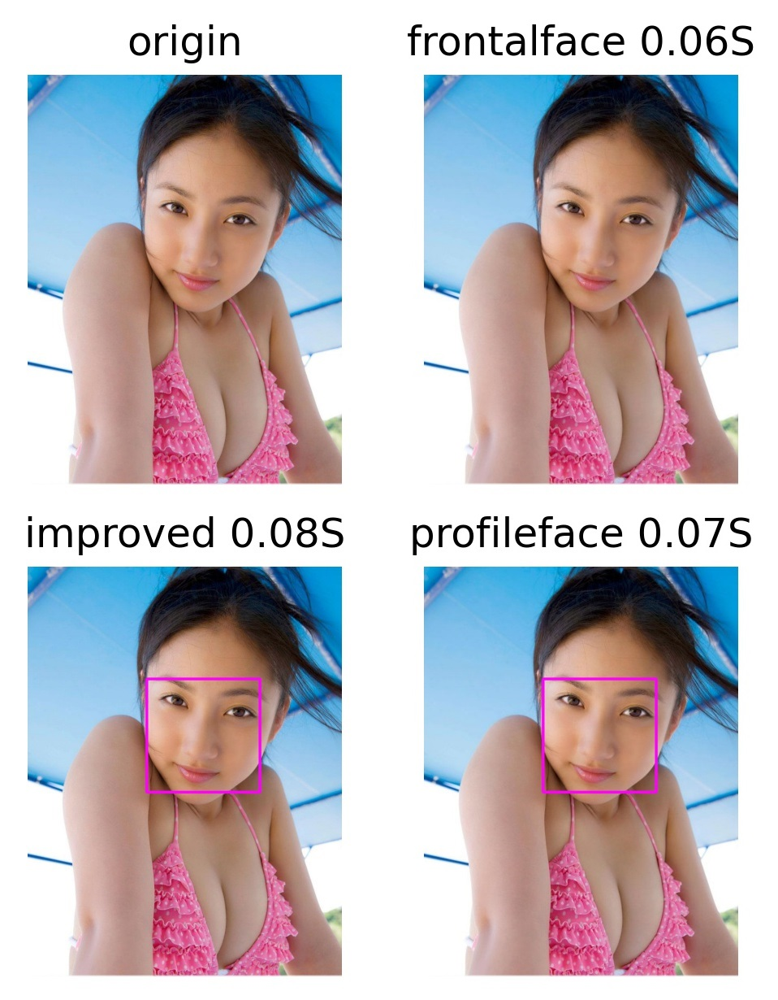
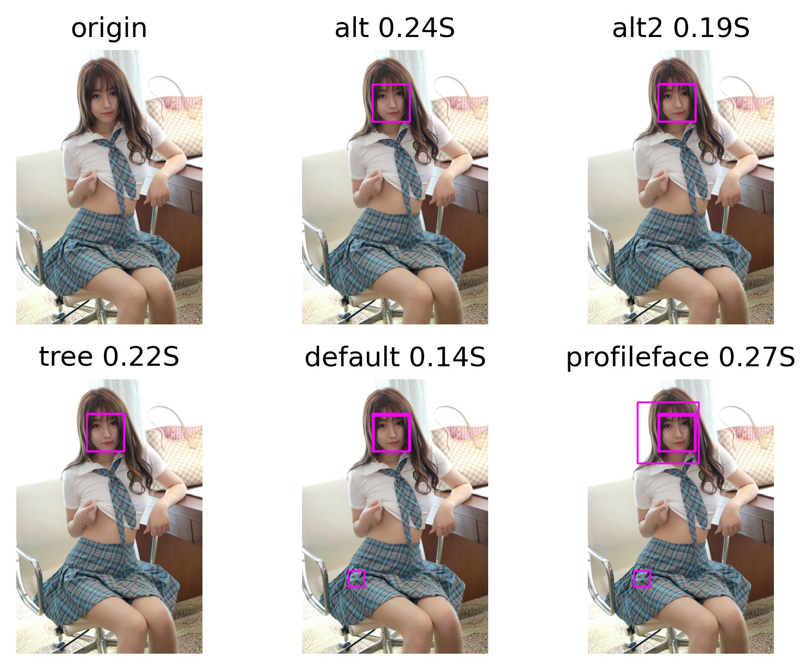
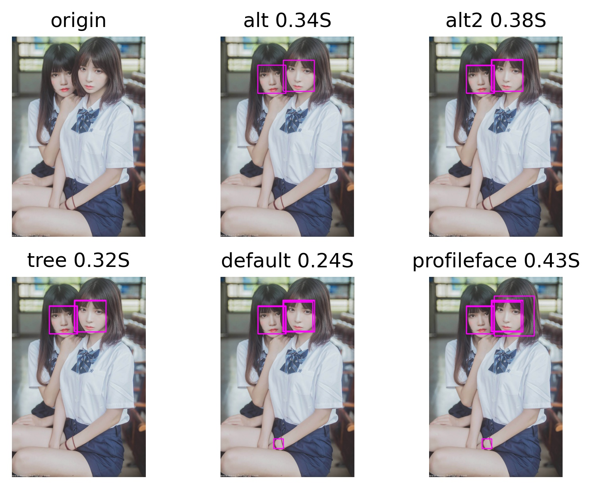
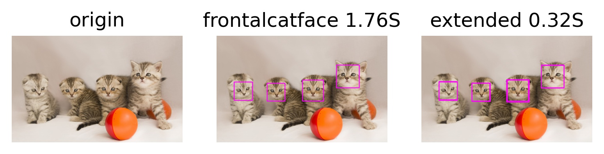
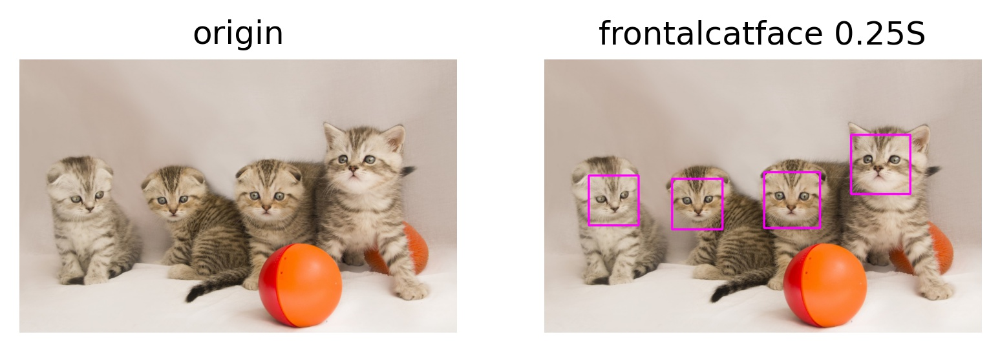
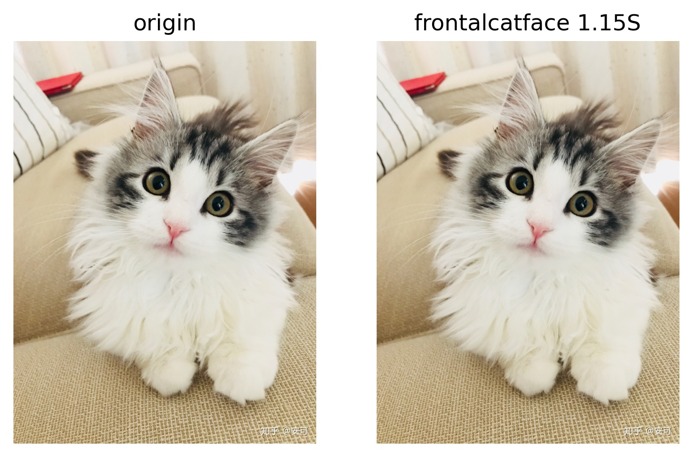
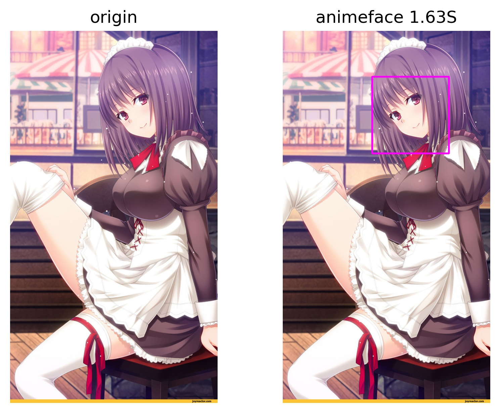

# Introduce
This is a face detection project based on **opencv-python**, which can detect the face of **human**, **cat** and **anime** characters.

# Demo
There are some examples for detection result.

## Human
### test_1
- haar



- lbp



### test_2
- haar



- lbp


### test_3
- haar



- lbp


## Cat
### test_1
- haar



- lbp


### test_2
- haar


- lbp (detect none)


### test_3
- haar


- lbp (detect none)


## Anime
### test_1
- lbp (only)


### test_2
- lbp (only)


### test_3
- lbp (only)


# Analysis
According to the detection result:
- For human face detection, `haarcascade_frontalface_alt.xml` is recommended.
- For cat face detection, `haarcascade_frontalcatface.xml` is recommended.
- For anime face detection, `lbpcascade_animeface.xml` is the only choice.

But if shorter time is what you want rather than precision, you can choose the lbp acascades files.

# Install
```bash
pip install opencv-python
```

# Usage
1. Put your pictures in the `img` foloder. E.g. if they are human images, put them in `img/human` path.
2. Run [face_detect.py](face_detect.py) and select your detection object.
3. Wait a few seconds, then view results in the `result` folder. E.g. if they are human images, the results are in `result/human` path.

# For video detection
## Demo
> Full vieo: [https://www.bilibili.com/video/BV1hA411p7R9](https://www.bilibili.com/video/BV1hA411p7R9)


## Usage
1. Open [video_detect.py](video_detect.py)
2. Edit the input arguments and select cascade `xml` file.
3. Run

# Cite
> [https://docs.opencv.org/master/db/d28/tutorial_cascade_classifier.html](https://docs.opencv.org/master/db/d28/tutorial_cascade_classifier.html)
> [https://github.com/nagadomi/lbpcascade_animeface](https://github.com/nagadomi/lbpcascade_animeface)
> [https://github.com/opencv/opencv](https://github.com/opencv/opencv)
